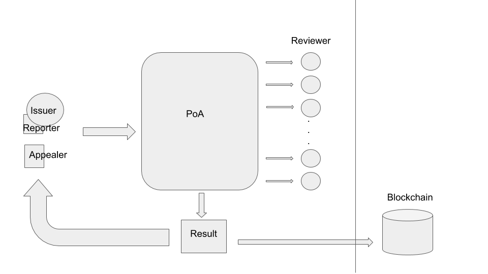
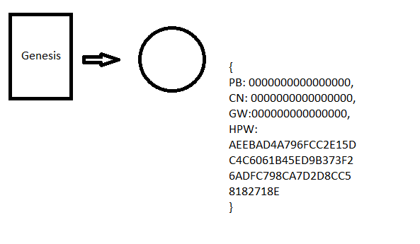
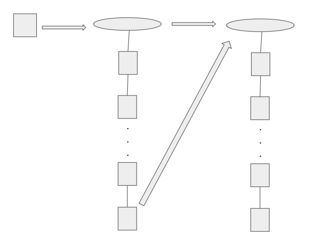
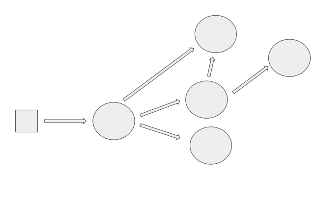

# settlementIO
Creating and trustful judgment system

As social media grow, the content inserted on that surpass millions of billions of data, and unfortunately the review of 
their contents are debatable, even the companies holding the rules of the content review.
We can see a lot of users complaining that their content were demonetized, deleted or their account blocked on various 
social medias. At the same time, news websites, biogs and others websites which have commentary section have a hard time 
to review and block texts that have hate speech, unadvised/misleading context, etc. The system is flawed, and the 
ecosystem of the growing internet can't hold old ways to solve a dispute.
When we expand this vision, we can see that not only social media, but any system that rely on dispute decisions based 
on a certain rules , for example any judgment system, not only the problem with the decisions made but the time consumed 
to have it decisions and the acceptance or not of the person to be under certain rules. 

When I started to write this white paper, my main goal was to create a distributed approach that could help companies to 
expand their review process without having the cost to hire more thousand of workers to review a exponential amount of data, 
where in a future will be almost impossible to them to review every content reported.

But , seeing that I could expand this to another areas, I realize this method of consensus I was trying to achieve was 
creating a new and private judgment system.

So, in order to take content review, games, and even the Justice to a new level , a new approach for this issue needs 
to be approached.

## Goal

The goal of settlementIO it's to define a Level 2 settlement algorithm and , with the approach of a new type of 
blockchain and Level 1 consensus, be able to create a Concurrency based on smart contracts where the content to be reviewed 
will be issued, reviewed and the result recorded , using digital signature, third party reviewers and law abid owners. 
To achieve this Goal , the contentIO will use a consensus algorithm called `Punitive Proof-of-Adequacy`

## 1. Punitive Proof-of-Adequacy

The punitive Proof-of-Adequacy is a type of  "Layer 2" settlement algorithm protocol that operates on top of a 
blockchain-based cryptocurrency network that aims to use a distributed consensus to achieve a result on a **settlement** 
dispute. In PoA-based cryptocurrencies there is an earlier level of consensus, where PoA act creating a network channel ,
choosing odd _n_ P2P curators([Reviewers](#33-Reviewer)) of a **settlement** dispute via various combinations of 
random selection of [Reputations](#Reputation), finally generating a smart contract of the result of the dispute , using
the fees to be shared among peers curators and the creator, known as [Witness](#Witness), of the next block. 

In able to record on a blockchain, PoA have little to none participation, and  The [Witness](#Witness) can be any Blockchain
smart contract-based network.

### 1.1 Process

When a [Reporter](#Reporter) file a **settlement** against the [Appealer](#35-appealer) , the Issuer(_I_) sends to the 
network the **settlement** to be reviewed(_r_), at this moment a [bounty](#Bounty) can be issued. It's from the discreet 
of the [_I_](#31-issuer) to notify the Appealed of the **settlement** dispute in course, if don't, 
it must be send the information.
eg.: 
```javascript
settlementIssued = {
    data : `<SETTLEMENT PROCESS>`,
    issuer: '688A044D54361D5762100BD1E6559AF4',
    reporter: '4A12FE7C3773A2B801BFFEB341A77949',
    appealer : '39AAF3FEF253178E15963B9CC27DA138'
}
```
The system will take a number(_n_) of _R_ , where this _n_ it's a odd quantity of minimum of 7, to a maximum of 25 of _R_, 
to be assigned to review the content issued. The _R_ assigned to the content to be reviewed are 
designated based on the following :

- Position on the assignment pool
- Reputation
- Waiting time

After the designation, the content receive a feedback of the _n_ assigned peer _R_, and the final [result](#Result) it's settled.
 The [Result](#Result) then it's sent back to PoA algorithm to record it on a blockchain. 

The PoA send a data to a [pool of results](#pool-of-results), to be recorded on a blockchain. The data must contain: 
- The Review reference/data [Result](#Result) of the settlement 
- The price distribution among the winners of the voting settlement added 60% of the [bounty](#Bounty) issued and 
reduced by the [Witness](#Witness) fee `G = pd + (b? b*(60/100) : 0) - wf`, if there is any.
- The Witness Total settlement fee attached to 40% fo a [bounty](#Bounty) issued `SF = wf + (b? b*(40/100): 0) `, if there is any, 
- The hash of all [reviewers](#33-Reviewer) which was on the settlement 
- The hash of the writing witness.

```javascript

settlementResult = {
  RR: '4A12FE7C3773A2B801BFFEB341A77949',
  G : `${pd + (b*(60/100) - wf)}`,
  SF : `${wf + (b*(40/100))}`,
  RW : ['CC54BD37BED550B4F756284A9FF42B4E', '79E9BBAE4E3C33C4EC16E1CCB303EE0B', 'CD47C54AFED2B25F833610FDB8875908', 
  '0AFB3728EC8AEB70B2B13FB1B6E714E2', '39AAF3FEF253178E15963B9CC27DA138', '92238FEAF3A982CF7D42D6C8FB52D804', 
  '688A044D54361D5762100BD1E6559AF4'],
  W: 'F56146D752AA1B96CB455B59FC017FD9'
}

```

> G is the total Grant of the [Result](#Result), pd = price distribution, b = bounty , SF = [Witness](#Witness) settlement fee, wf = [Witness](#Witness) fee

A [Witness](#Witness) it's assigned to generate a block on the blockchain via PoS, PoW or the 
[Witness](#Witness) Assignment Logic. Then it will take _n_ data from the [pool of results](#pool-of-results) and 
record it on the blockchain


#### 1.1.1 In a nutshel :




### 1.2 Appeal
A Appeal of the [Result](#Result) can be issued and restart the process , generating a new data to be recorded on the 
block referring the hash of the last [Result](#Result). 

If the result it's the same, the **settlement** it's closed and It can't be Appealed again(appealFowardResult). 

If the Appeal it's giving a different result, but the algorithm request a another appeal process to be retrieve the 
result of the Issuer. Depending of the result, it's fires the punitive algorithm which will reduce the **Reputation** and 
a charge fee to be deducted of the loosing peer reviewers, adding the charge on the prize of the next **settlement** 
dispute of the Issuer(appealBlockingResult). 

The reviewers charged can't appeal, as they aren't one of the 3 p2p actors with this level of permission.

```javascript

appealFowardResult = {
  LR: `F56146D752AA1B96CB455B59FC017FD9`,
  RR: '4A12FE7C3773A2B801BFFEB341A77949',
  G : `${pd + (b*(60/100)) - wf}`,
  SF : `${wf + (b*(40/100))}`,
  RW : ['CC54BD37BED550B4F756284A9FF42B4E', '79E9BBAE4E3C33C4EC16E1CCB303EE0B', 
  'CD47C54AFED2B25F833610FDB8875908', '0AFB3728EC8AEB70B2B13FB1B6E714E2', '39AAF3FEF253178E15963B9CC27DA138', 
  '92238FEAF3A982CF7D42D6C8FB52D804', '688A044D54361D5762100BD1E6559AF4'],
  W: 'F56146D752AA1B96CB455B59FC017FD9'
}

```

```javascript

appealBlockingResult = {
  WR: '39AAF3FEF253178E15963B9CC27DA138',
  LR: 'F56146D752AA1B96CB455B59FC017FD9',
  RR: '4A12FE7C3773A2B801BFFEB341A77949',
  G : `${pd + (b*(60/100)) - wf}`,
  SF : `${wf + (b*(40/100))}`,
  RW : ['CC54BD37BED550B4F756284A9FF42B4E', '79E9BBAE4E3C33C4EC16E1CCB303EE0B', 'CD47C54AFED2B25F833610FDB8875908', 
  '0AFB3728EC8AEB70B2B13FB1B6E714E2', '39AAF3FEF253178E15963B9CC27DA138', '92238FEAF3A982CF7D42D6C8FB52D804', 
  '688A044D54361D5762100BD1E6559AF4'],
  W: 'F56146D752AA1B96CB455B59FC017FD9'
}

```


### 1.3 Assignment pool

When a _R_ request a **settlement** for a review , the algorithm will gets the first [reviewer](#33-Reviewer) available 
on the Pool (_P_) of assigment and ask for a review, then the [reviewer](#33-Reviewer) it's sent to the end of the _P_. 
The [reviewer](#33-Reviewer) will recieve the **settlement** and the _I_ rules and define if the **settlement** it's on 
favor or against the [Reporter](#Reporter). After the [reviewer](#33-Reviewer) gives it's vote, the algorithm will 
require for the next assignee [reviewers](#33-Reviewer) on the _P_, having this [reviewer](#33-Reviewer) a different 
level of [Reputation](#Reputation)(as seen on [Assignment Ordenation](#121-assignment-ordenation)). After the minimum 
of 7 votes, the algorithm checks if the **settlement** have a result, if not it will assing another 
[reviewer](#33-Reviewer) until the next odd _n_ of votes and check for the result, having this behaviour until _n_ of 
votes it's 25.   
This _P_ it's responsible to queue the assignees to be assign to a next **settlement**. The quantity of _R_ to be 
assigned(_A_) will be the minimum of 7, to a maximum of 25.

> `_A_ = _R_.get((reviewer) => { return reviewer })`

#### 1.3.1 Assignment Ordination
In order to keep the pool assignment with the must trustful result as possible, the [Reputation](#14-reputation) of 
_n_ _R_ should be differentiated, getting the advantage of distributing _n_ assignees on a single review by a range 
of experienced _R_ to new one(or still pooly trustable) on the peer network. This range are defined by the _R_ 
reputation (defined on section [Reputation](#reputation)). To control and maintain the trustful of the network the 
votes will be weight by the assignee reputation, giving the system a controlled and better results of the reviews.
Doing that, the aiming it's to avoid misleading engagement or vicious behaviour from more experienced peer users, avoid 
power centralization among the reputation peers, and give a more honest result of the review.
The weight of the votes it's referred on the [Vote System Weight](#vote-system-weight) section.

### 1.3 Bounty

Bounty it's a additional fee inserted on the **settlement** dispute , created to enable the possibility of a Issuer to 
require a faster result on a dispute it's generated. A dispute with an added bounty it gains priority on top of any other 
dispute on the network.

### 1.4 Reputation

A Range of reputation(_rp_) it's given to the _R_ , these are "Trustful", "MidLevel", "Non-Trustful" and "Undesirable".
 When a new _R_ it's created, a "Non-Trustful" level it's assign to it's status. The more engaged 
 
### 1.5 Waiting time 

The Last Will be First.

### 1.6 Vote System Weight

A _A_ must have assignees distributed on the following reputation  : _R_['Trustfull'] = 25% , _R_['MidLevel'] = 30%, 
_R_['Non-Trustfull'] = 45%. The reputation defines the power of the vote of each assignees. The "Non-Trustful"(_ntt_) 
it's the benchmark voter, where "MidLevel" has `1.5*ntt` vote power , and the "Trustful" _R_ having `2.5*ntt` vote 
power.


### 1.7 Result

### 1.8 Pool of Results

### 1.9 Reputation gratifications/punishment


### 1.10 Benefit of doubt
A **settlement** dispute must have a trustful result, and for that, a **settlement** have to be reviewed by a odd `n` 
of [Reviewers](#33-Reviewer)(_R_). To ensure a result it's trustful, the algorithm allow the 
[benefit ouf doubt](#benefit-of-doubt) of any **settlement** result, and this doubt it's granted to the 3 p2p actors. 
They are the 2 parts on the dispute, the [Reporter](#Reporter) and the [Appealer](#Appealer), and the law abiding 
[Issuer](#31-issuer), who defines the [rules](#rules-of-the-settlement) where a **settlement** dispute is going on. 
The amount of [benefit ouf doubt](#benefit-of-doubt) it's determined by it's own cryptocurrency blockchain network, 
but in able to avoid fraud it's recommended to follow the instructions on this paperwork.


## 2. Rules of the settlement

The Rules of the settlement it's defined by the [Issuer](#Issuer), so the PoA defines this actor the single source of 
truth when a [Benefit of doubt](#110-benefit-of-doubt) it's on.

## 3. Actors

### 3.1 Issuer
A company like Facebook , request to the blockchain a content to be reviewed , issuing a value(bounty) to be paid for 
that content.

### 3.2 Reporter

### 3.3 Reviewer 
The first `n` users connected to the platform who selfAssign the review lock the analysis of that content and give 
their result, the distribution of the review it's held by the **Witness**, who assign the review on the pool and check 
the  **Reviewer** `poor-of-integrity`, based on the issuer internal policies. The users can't know each others , so 
that the system works a non-trustful nodes.

### 3.4 Witness
The **Witness** it's the algorithm(miner) which will hold the distribution of the **Issuer** content for review trough 
the **Reviewers** , defined by `location` , `reputation`, `proof-of-stake`. Once the **Reviews** are issued, **Witness**
 algorithms take the reviewers result, and record the content result on the **Chain**, working as a notary book for 
 consultation by the **Issuer**. Therefore the prize value are divided between the **Reviewers** and credit on their
  account, which will be paid monthly/weekly. A **Witness** node who insert the **Review** first it's granted the fee 
  charged from the **Issuer**. The **Issuer** can be a **Witness** for the chain.

### 3.5 Appealer
Users/reporters who have a **settlement** result against their will, can appeal te result of the review and a new
 request are issued. _n_ appeals can be granted by **settlement** , defined by default of by the **Issuer**. It's 
 from the discreet of the _I_ to notify the Appealer of the **settlement** dispute in course, but the Appealer must 
 be notified after the result. And the _I_ must inform the network if the Appealer were notified when the **settlement** 
 dispute were post in course


## 4 Witness Assignment Logic , or : DAG2D, Blockchain at scale


As the blockchain technology growths, more need to develop new ideas are necessary.
 The current solutions to solve the scalability of a blockchain relied on a unique linear block. 
 But that's not the only way a blockchain can grow. Trying to achieve a higher level of scalability, i've decided 
 to create a new approach , i've decided to create a blockchain ledger which can achieve a bi-dimensional chain 
 of transactions.

The 2 dimensional blockchain consists in :

1. generate a Directed Acyclic Graph, as the parent node , this parent node will hold the previous block number, 
the previous child node block generated, the previous Witness which generated it parent block  
and the hash power (or mining power) as the lenght of that node. The genesis block would have the representation like :

```javascript
block = {
GB: '00000000000000000000000000000000',
CN: '00000000000000000000000000000000',
GW: '00000000000000000000000000000000',
HP: '688A044D54361D5762100BD1E6559AF4'
}
```




2. the child blockchain of the parent node. This blockchain have the length of the hash power of the parent node, meaning
it can't have more than the length of the parent node grant.
All the blocks of this chain will have on it's data the record of the previous block and the parent node block.



On the child blockchain is that the **settlement** results will be stored.

Once the child blockchain reach it's total length. 
The algorithm fires the challenge to generate 2 additional parent nodes. 
The Witness dispute to generate the blocks, the winner will be granted as the creator of the parent node.




The main goal on this ledger is to use the parent nodes as indexation nodes, which can be used to faster retrieve previous
transactions on the blockchain.  

#### 4.1 Inversed Proof-of-Stake

Any Witness on the network can record data to a child blockchain.
When a Witness win the competition to write a new child blockchain node, it's consults if the parent node have the
length achieved, if so, it checks if there is any other parent node which it didnt reach it's full length. 
If it exists, the Witness record the data and generate the node on that blockchain , if not, 
it requests to the network to a new parent node to be generated.

The Witness which required a parent node to be generated can't dispute on this process, 
it awaits to a new parent block to be generated to record the transaction it is holding.

The Witness dispute to record a new parent node or child node it's based on it's reputation, 
using a `Inversed Proof-of-Stake`. 
When a there is data to be recorded to a block , 
the Witness available to do it will ask to do write, the Witness with the 
higher reputation it granted to record the block , if a Witness win a dispute more than _n_ times, 
your Reputation it's degraded. When a Witness looses for _n_ times, 
it's reputation its increased. And if a Witness looses _n_ times even after it's reputation, 
it is granted the right to generate the next block. 
If there is a conflict where the 2 or more Witness have the same right to write a block , 
it wins who have more timestamp on the network. A challenge to found a nounce can be added to the ledger.


## 5. Security measurement
How to secure the block


## 6. Pros
Company can use the platform where the pool of nodes to be reviewed can give more returns for the content **Reviewers**
Platform can be `onPrem` or `onCloud`.
**Reviews** can be more reliable.

## 7. Cons

Who review the **Reviewer**

Develop how the platform will receive the content from the **Issuer** and deliver it to the **Reviewer**

Define how a appeal must be accepted by a **Reviewer**. A `punitive proof-of-adequacy` must be implemented in full to
 enforce the need of the reviewer be trustful on his/her review(also can work for managing the user behaviour)


